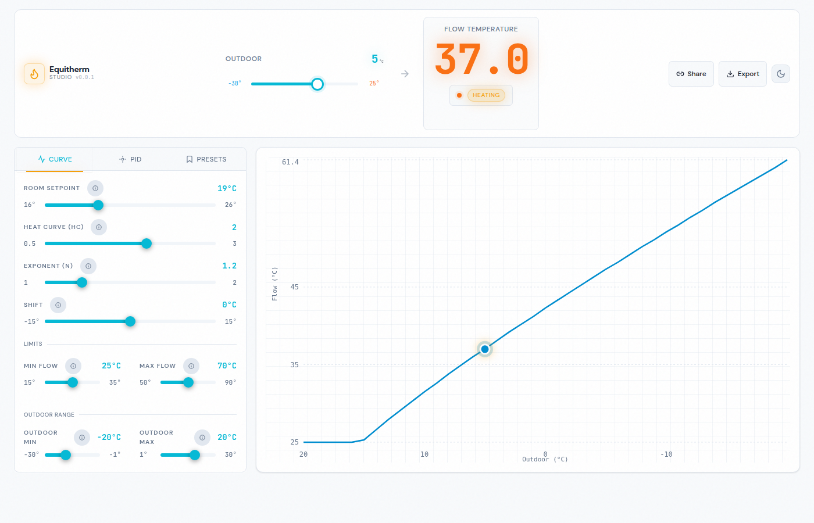

<div align="center">

# equitherm-studio

**Visual companion tools for the ESPHome [`equitherm`](https://github.com/P4uLT/esphome) climate component**

[](https://github.com/P4uLT/equitherm-studio/actions/workflows/ci.yml)
[](LICENSE)
[](https://p4ult.github.io/equitherm-studio/)

[**→ Open the app**](https://p4ult.github.io/equitherm-studio/)

</div>

---

Configuring an equitherm heating curve means tuning several interdependent parameters — heat curve coefficient, exponent, shift, flow limits — and guessing wrong means your boiler either never reaches setpoint or overshoots it. **equitherm-studio** lets you see the full curve in real time, simulate PID corrections at any outdoor temperature, and export a ready-to-paste ESPHome YAML config, all without touching your device.



---

## Features

### Heating Curve Calculator
- Interactive chart showing flow temperature across the full outdoor range
- Live updates as you adjust any parameter — no submit button
- Configurable outdoor range, flow min/max, room setpoint, shift

### PID Simulator
- Offset mode (room error from setpoint) or absolute mode (actual room temp)
- See how Kp adjusts the curve in real time
- Deadband configuration with per-parameter multipliers (Kp/Ki/Kd)

### ESPHome YAML Generator
- One-click export of a complete `equitherm` climate config block
- Only includes non-default values — clean, minimal output
- Optional diagnostic sensors and runtime tuning number entities

### Share & Save
- **URL sharing** — every config state is encoded in the URL, shareable as a link
- **Presets** — save up to 10 named configurations in your browser (LocalStorage)
- **No account, no server** — everything runs in your browser

### Interface
- Dark / light theme (ESPHome-inspired palette)
- Mobile-first responsive layout with container queries
- Keyboard-accessible sliders via shadcn/ui + Radix primitives

---

## Try it

**No install needed.** Open [https://p4ult.github.io/equitherm-studio/](https://p4ult.github.io/equitherm-studio/) in any modern browser.

To share your configuration, click **Share** in the header — the URL encodes all parameters and can be sent directly.

---

## How it works

The flow temperature formula at the core of the equitherm component:

```
t_flow = t_target + shift + hc × (t_target - t_outdoor)^(1/n)
```

| Parameter  | Description              | Range        |
|------------|--------------------------|--------------|
| `t_target` | Room setpoint            | 16 – 26 °C   |
| `hc`       | Heat curve coefficient   | 0.5 – 3.0    |
| `n`        | Curve exponent           | 1.0 – 2.0    |
| `shift`    | Constant offset          | −15 to +15 °C|
| `minFlow`  | Minimum flow temperature | 15 – 35 °C   |
| `maxFlow`  | Maximum flow temperature | 50 – 90 °C   |

The result is clamped to `[minFlow, maxFlow]` and rounded to 0.1 °C precision (OpenTherm convention).

All computation runs in the browser via [`@equitherm-studio/core`](#equitherm-studiocore-library) — no network requests, no telemetry.

---

## `@equitherm-studio/core` library

The calculation logic is extracted into a standalone, zero-dependency TypeScript library. Use it independently of the web app:

```typescript
import {
  computeFlowTemperature,
  computePID,
  isInDeadband,
} from '@equitherm-studio/core';
import type { CurveParams, PIDState } from '@equitherm-studio/core';

// Calculate flow temperature
const flow = computeFlowTemperature({
  tTarget: 19,
  tOutdoor: -5,
  hc: 2.0,
  n: 1.2,
  shift: 0,
  minFlow: 25,
  maxFlow: 70,
});
// → 60.2

// PID correction
const pid: PIDState = { kp: 0.5, ki: 0.0, kd: 0.0 };
const result = computePID(pid, /* setpoint */ 19, /* actual */ 18.5);
// → { total: 0.25, p: 0.25, i: 0, d: 0 }
```

The library has no DOM or framework dependencies and works in any JavaScript environment (Node.js, browser, ESPHome automations via Espruino, etc.).

---

## Development

This is a [pnpm](https://pnpm.io) monorepo:

| Package | Description |
|---------|-------------|
| `packages/core` | `@equitherm-studio/core` — pure calculation library |
| `packages/web`  | `@equitherm-studio/web` — React web application |

```bash
# Install dependencies
pnpm install

# Start dev server (localhost:5173)
pnpm dev

# Run tests
pnpm test

# Type check
pnpm typecheck

# Build all packages
pnpm build
```

Or via [Task](https://taskfile.dev): `task dev`, `task test`, `task ci`.

**Tech stack:** React 19 · Vite 5 · Zustand · Recharts · shadcn/ui · Tailwind CSS · Vitest

---

## Self-hosting

The app is a fully static build — no server required.

```bash
pnpm install
pnpm build
# Serve packages/web/dist/ on any static host
```

The GitHub Pages deployment is automatic on every push to `main`.

---

## Contributing

Bug reports, feature requests, and pull requests are welcome. See [CONTRIBUTING.md](CONTRIBUTING.md) for setup instructions and code style guidelines.

---

## Related

- [ESPHome `equitherm` component](https://github.com/P4uLT/esphome) — the climate component this tool configures
- [ESPHome documentation](https://esphome.io/components/climate/equitherm/) — official ESPHome docs

---

## License

[MIT](LICENSE) © P4uLT
